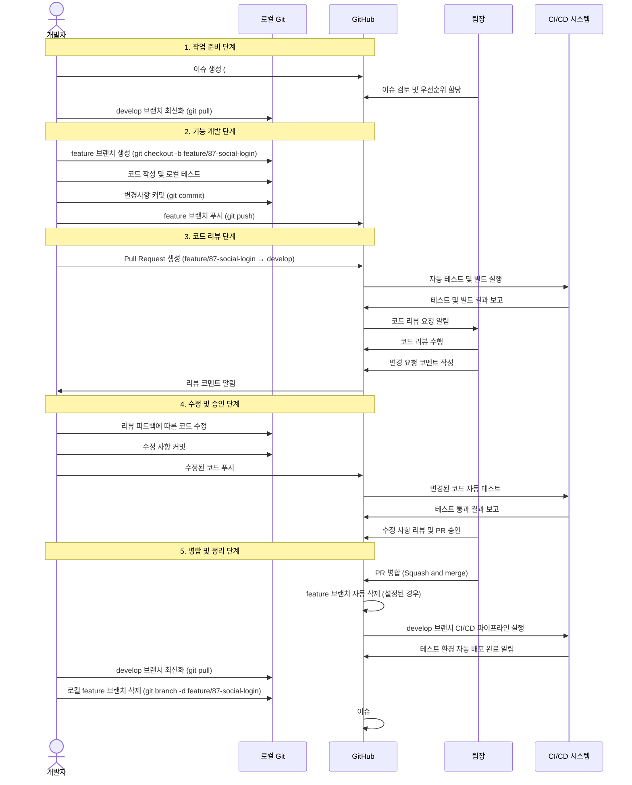
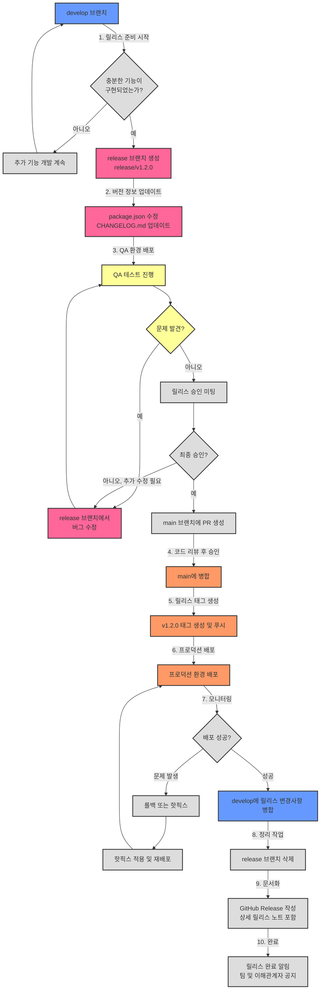
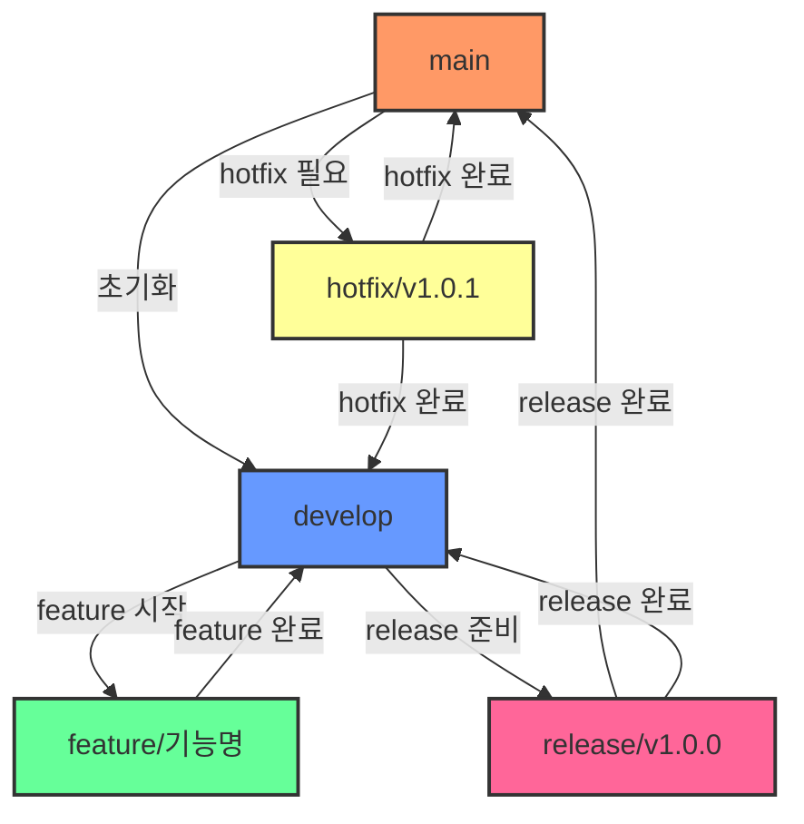
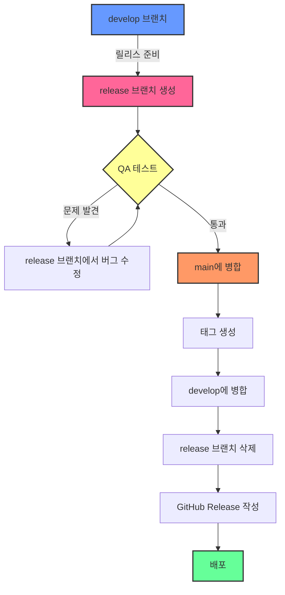

## 주요 워크플로우

### 1. 기능 개발 시퀀스 다이어그램 (상세)



위 시퀀스 다이어그램은 기능 개발의 전체 과정을 다음 단계로 상세하게 보여줍니다:

1. **작업 준비 단계**: 이슈 생성부터 개발 시작 전 준비까지
2. **기능 개발 단계**: 로컬에서의 기능 개발 및 커밋 과정
3. **코드 리뷰 단계**: PR 생성부터 리뷰 요청 및 피드백까지
4. **수정 및 승인 단계**: 리뷰 피드백 반영 및 최종 승인
5. **병합 및 정리 단계**: 코드 병합 및 브랜치 정리, 이슈 종료

### 2. 릴리스 프로세스 플로우차트 (상세)



이 릴리스 프로세스 플로우차트는 릴리스 과정을 10단계로 상세하게 보여줍니다:

1. **릴리스 준비 시작**: develop 브랜치에서 충분한 기능이 구현되었는지 평가
2. **버전 정보 업데이트**: 버전 번호 변경 및 변경 로그 업데이트
3. **QA 환경 배포**: QA 테스트를 위한 환경 구성 및 테스트 진행
4. **코드 리뷰 및 승인**: 릴리스 코드의 최종 검토 및 승인
5. **릴리스 태그 생성**: 공식 릴리스 버전 태그 생성
6. **프로덕션 배포**: 사용자에게 새 버전 배포
7. **모니터링**: 배포 후 시스템 상태 모니터링
8. **정리 작업**: 릴리스 브랜치 정리 및 develop 브랜치 업데이트
9. **문서화**: 상세 릴리스 노트 작성 및 GitHub Release 생성
10. **완료**: 릴리스 완료 후 관련 당사자들에게 알림# Git Flow 기반 GitHub 사용 매뉴얼

## 목차
1. [개요](#개요)
2. [Git Flow 전략 소개](#git-flow-전략-소개)
3. [브랜치 구조 및 규칙](#브랜치-구조-및-규칙)
4. [팀장용 가이드](#팀장용-가이드)
5. [팀원용 가이드](#팀원용-가이드)
6. [주요 워크플로우](#주요-워크플로우)
7. [이슈 및 PR 관리](#이슈-및-pr-관리)
8. [코드 리뷰 프로세스](#코드-리뷰-프로세스)
9. [릴리스 관리](#릴리스-관리)
10. [자주 발생하는 문제 해결](#자주-발생하는-문제-해결)
11. [유용한 GitHub 기능](#유용한-github-기능)
12. [참고 자료](#참고-자료)

## 개요

이 매뉴얼은 Git Flow 전략을 활용하여 GitHub에서 효율적으로 협업하는 방법을 안내합니다. 팀장과 팀원들이 일관된 방식으로 개발을 진행하고, 코드 품질을 유지하며, 릴리스 관리를 원활히 할 수 있도록 상세한 가이드라인을 제공합니다.

## Git Flow 전략 소개

Git Flow는 Vincent Driessen이 제안한 Git 브랜칭 모델로, 체계적인 개발 및 릴리스 관리를 위한 워크플로우를 제공합니다. 이 전략은 다양한 개발 상황과 릴리스 사이클을 효과적으로 관리할 수 있게 해줍니다.

### Git Flow 개념도

```
    ─────────────────────────▶ develop ─────────────────────────────▶
       │                         │                         │
       │                         │                         │
       ▼                         ▼                         ▼
   feature/...               feature/...               feature/...
       │                         │                         │
       │                         │                         │
       └─────────────────────────┴─────────────▶ release/v1.0 ───────▶
                                                    │
                                                    │
                                                    ▼
                                                  hotfix/...
                                                    │
                                                    │
    ◀─────────────────────────────────────────────▶ main ◀────────────
```

### 주요 브랜치 유형

- **main**: 제품 출시 버전을 관리하는 브랜치입니다. 항상 안정적이고 배포 가능한 상태를 유지합니다.
  - **예시**: 웹 애플리케이션의 경우, `main` 브랜치는 현재 프로덕션 환경에 배포된 코드와 동일합니다. 예를 들어 v1.2.3 버전이 현재 출시된 버전이라면, `main` 브랜치는 이 버전의 코드를 포함합니다.

- **develop**: 다음 릴리스를 위한 개발 브랜치로, 모든 새로운 기능 개발의 기반이 됩니다.
  - **예시**: 팀이 v1.3.0을 준비 중이라면, `develop` 브랜치에는 이전 안정 버전(v1.2.3)에 추가될 새로운 기능들이 통합됩니다. 예를 들어, 사용자 프로필 기능, 알림 시스템 개선, 성능 최적화 등의 여러 기능이 `develop` 브랜치에 병합됩니다.

- **feature/**: 새 기능 개발을 위한 브랜치로, `develop` 브랜치에서 분기하여 작업 후 다시 `develop`으로 병합됩니다.
  - **예시**: 팀원이 새로운 결제 시스템을 개발하려면, `feature/123-payment-system`과 같은 브랜치를 만들어 작업합니다. 이 브랜치에서는 결제 API 연동, 결제 폼 UI 구현, 결제 처리 로직 등의 작업이 이루어집니다. 기능 완성 후 `develop` 브랜치로 병합됩니다.

- **release/**: 릴리스 준비를 위한 브랜치로, 릴리스 전 버그 수정과 문서 업데이트 등을 수행합니다.
  - **예시**: v1.3.0 출시를 앞두고 `release/v1.3.0` 브랜치를 생성합니다. 이 브랜치에서는 버전 번호 업데이트, 릴리스 노트 작성, QA 과정에서 발견된 버그 수정(예: 특정 브라우저에서 UI 깨짐 현상 해결) 등의 작업이 이루어집니다. 모든 준비가 완료되면 `main`과 `develop` 브랜치에 모두 병합됩니다.

- **hotfix/**: 출시된 버전의 긴급 버그 수정을 위한 브랜치로, 프로덕션 환경에서 발견된 중요 버그를 빠르게 해결합니다.
  - **예시**: 프로덕션 환경(v1.2.3)에서 보안 취약점이 발견되었다면, `hotfix/v1.2.4` 브랜치를 `main`에서 분기하여 생성합니다. 이 브랜치에서 보안 취약점을 수정한 후, 수정사항을 `main`과 `develop` 브랜치에 모두 병합하고 v1.2.4 태그를 생성하여 배포합니다.

## 브랜치 구조 및 규칙

### 브랜치 명명 규칙

- **main**: 제품 출시 버전
- **develop**: 개발 메인 브랜치
- **feature/[이슈번호]-[기능명]**: 예) feature/123-user-login
  - **실제 예시**: 사용자 인증 시스템 개발을 위한 이슈 번호가 #42인 경우, `feature/42-user-authentication` 형식으로 브랜치 이름을 지정합니다.
- **release/v[주버전].[부버전].[수버전]**: 예) release/v1.2.0
  - **실제 예시**: 2.0.0 버전 출시 준비를 위해 `release/v2.0.0` 형식으로 브랜치 이름을 지정합니다. 이는 메이저 버전 업그레이드를 의미합니다.
- **hotfix/v[주버전].[부버전].[수버전]**: 예) hotfix/v1.2.1
  - **실제 예시**: 현재 프로덕션 버전이 1.3.5이고 심각한 로그인 버그가 발견되었다면, `hotfix/v1.3.6` 형식으로 브랜치 이름을 지정하여 패치 버전을 증가시킵니다.

### 브랜치 생명주기




### 브랜치 생명주기 상세 다이어그램

```mermaid
graph TD
    classDef main fill:#f96,stroke:#333,stroke-width:2px
    classDef develop fill:#69f,stroke:#333,stroke-width:2px
    classDef feature fill:#6f9,stroke:#333,stroke-width:2px
    classDef release fill:#f69,stroke:#333,stroke-width:2px
    classDef hotfix fill:#ff9,stroke:#333,stroke-width:2px
    
    A[main] -->|프로젝트 초기화| B[develop]
    B -->|이슈 #123 생성| C1[feature/123-user-login]
    B -->|이슈 #124 생성| C2[feature/124-product-list]
    B -->|이슈 #125 생성| C3[feature/125-shopping-cart]
    
    C1 -->|PR 및 코드 리뷰 후 병합| B
    C2 -->|PR 및 코드 리뷰 후 병합| B
    C3 -->|PR 및 코드 리뷰 후 병합| B
    
    B -->|릴리스 준비 - v1.0.0| D[release/v1.0.0]
    
    D -->|QA 중 버그 발견 #126| D1[버그 수정 커밋]
    D1 -->|추가 QA 중 버그 발견 #127| D2[버그 수정 커밋]
    D2 -->|QA 통과| E[PR 생성 및 승인]
    
    E -->|릴리스 완료| F1[main에 병합]
    F1 -->|v1.0.0 태그 생성| F2[태그 v1.0.0]
    F1 -->|릴리스 노트 작성| F3[GitHub Release]
    
    E -->|릴리스 변경사항 반영| G[develop에 병합]
    
    F2 -->|버그 #128 발견| H[hotfix/v1.0.1]
    H -->|버그 수정| I[PR 생성 및 승인]
    I -->|핫픽스 반영| J1[main에 병합]
    J1 -->|v1.0.1 태그 생성| J2[태그 v1.0.1]
    
    I -->|핫픽스 변경사항 반영| K[develop에 병합]
    
    B -->|이슈 #130-#135 구현 완료 후| L[release/v1.1.0]
    
    class A main
    class B develop
    class C1,C2,C3 feature
    class D,D1,D2,L release
    class H hotfix


## 팀장용 가이드

### 1. 프로젝트 초기 설정

1. GitHub 저장소 생성 및 설정
   ```bash
   # 원격 저장소 생성 후 클론
   git clone https://github.com/organization/project.git
   cd project
   ```
   **상세 예시**: 새로운 React 웹 애플리케이션 프로젝트의 경우, GitHub에서 'my-react-app' 저장소를 생성한 후 아래와 같이 클론합니다.
   ```bash
   git clone https://github.com/myteam/my-react-app.git
   cd my-react-app
   ```

2. 기본 브랜치 구조 설정
   ```bash
   # main 브랜치 생성 (이미 존재할 경우 생략)
   git checkout -b main
   
   # 첫 커밋
   echo "# Project Name" > README.md
   git add README.md
   git commit -m "Initial commit"
   git push -u origin main
   
   # develop 브랜치 생성
   git checkout -b develop
   git push -u origin develop
   ```
   **상세 예시**: React 프로젝트의 초기 설정 시, 프로젝트 기본 구조를 생성하고 main 브랜치에 푸시한 후, develop 브랜치를 생성합니다.
   ```bash
   # main 브랜치 초기화
   npx create-react-app .
   git add .
   git commit -m "Initial React app setup"
   git push -u origin main
   
   # develop 브랜치 생성
   git checkout -b develop
   # 개발에 필요한 추가 라이브러리 설치
   npm install axios styled-components react-router-dom
   git add .
   git commit -m "Add development dependencies"
   git push -u origin develop
   ```

3. GitHub 저장소 설정
   - 기본 브랜치를 `develop`으로 설정
   - 브랜치 보호 규칙 설정:
     - `main`: 직접 푸시 금지, 리뷰 필수, 빌드 통과 필수
     - `develop`: 직접 푸시 금지, 리뷰 필수
   
   **상세 예시**: GitHub 저장소 설정 페이지에서 다음과 같이 설정합니다.
   1. Settings > Branches > Default branch에서 `develop`을 기본 브랜치로 변경
   2. Settings > Branches > Branch protection rules에서 다음과 같이 규칙 추가:
      - `main` 브랜치 보호 규칙:
        - "Require pull request reviews before merging" 체크
        - "Require status checks to pass before merging" 체크
        - "Require branches to be up to date before merging" 체크
        - "Include administrators" 체크 (모든 팀원이 규칙을 따르도록)
      - `develop` 브랜치 보호 규칙:
        - "Require pull request reviews before merging" 체크
        - "Require branches to be up to date before merging" 체크

4. 이슈 템플릿 및 PR 템플릿 설정
   - `.github/ISSUE_TEMPLATE/` 디렉토리에 이슈 템플릿 생성
   - `.github/PULL_REQUEST_TEMPLATE.md` 파일에 PR 템플릿 생성
   
   **상세 예시**: 다음과 같은 이슈 템플릿과 PR 템플릿을 생성합니다.
   
   **기능 이슈 템플릿** (`.github/ISSUE_TEMPLATE/feature_request.md`):
   ```markdown
   ---
   name: 기능 요청
   about: 새로운 기능이나 개선 사항 제안
   title: '[FEATURE] '
   labels: 'feature'
   assignees: ''
   ---

   ## 설명
   원하는 기능에 대한 명확하고 간결한 설명을 제공해 주세요.

   ## 해결하고자 하는 문제
   이 기능이 해결하고자 하는 문제나 사용자 요구사항을 설명해 주세요.

   ## 제안하는 해결책
   구현 방법에 대한 아이디어가 있다면 설명해 주세요.

   ## 완료 조건
   - [ ] 조건 1
   - [ ] 조건 2
   - [ ] 조건 3

   ## 추가 컨텍스트
   스크린샷, 참고 링크, 설계 문서 등을 첨부해 주세요.
   ```
   
   **PR 템플릿** (`.github/PULL_REQUEST_TEMPLATE.md`):
   ```markdown
   ## 변경 사항 설명
   이 PR에서 무엇이 변경되었는지 간략히 설명해 주세요.

   ## 관련 이슈
   해결하는 이슈를 연결해 주세요: #이슈번호

   ## 변경 유형
   - [ ] 새로운 기능 (breaking change 없음)
   - [ ] 버그 수정 (breaking change 없음)
   - [ ] 문서 업데이트
   - [ ] 코드 리팩토링
   - [ ] 성능 개선
   - [ ] 테스트 추가/수정
   - [ ] Breaking change (기존 기능에 영향을 주는 변경)

   ## 테스트 방법
   변경 사항을 테스트하는 방법을 설명해 주세요.

   ## 스크린샷 (필요한 경우)
   UI 변경 사항이 있는 경우 스크린샷을 첨부해 주세요.

   ## 체크리스트
   - [ ] 코드가 스타일 가이드를 준수합니다.
   - [ ] 변경 사항에 대한 테스트를 추가했습니다.
   - [ ] 모든 테스트가 통과합니다.
   - [ ] 문서가 업데이트되었습니다.
   ```

### 2. 릴리스 관리

1. 릴리스 브랜치 생성
   ```bash
   # develop 브랜치에서 시작
   git checkout develop
   git pull
   
   # 릴리스 브랜치 생성
   git checkout -b release/v1.0.0
   git push -u origin release/v1.0.0
   ```
   
   **상세 예시**: 팀이 첫 번째 릴리스를 준비하는 경우, 다음과 같이 릴리스 브랜치를 생성합니다.
   ```bash
   git checkout develop
   git pull  # 최신 develop 브랜치 변경 사항 가져오기
   
   # 릴리스 브랜치 생성
   git checkout -b release/v1.0.0
   
   # 버전 정보 업데이트 (package.json 파일이 있는 경우)
   npm version 1.0.0 --no-git-tag-version
   
   # 릴리스 준비 커밋
   git add package.json package-lock.json
   git commit -m "Prepare release v1.0.0"
   git push -u origin release/v1.0.0
   ```
   이후 QA 팀은 이 릴리스 브랜치에서 테스트를 진행하고, 발견된 버그는 이 브랜치에서 직접 수정합니다.

2. 릴리스 브랜치 병합 및 태그 생성
   ```bash
   # 릴리스 브랜치에서 최종 수정 완료 후
   
   # main에 병합
   git checkout main
   git pull
   git merge --no-ff release/v1.0.0 -m "Release v1.0.0"
   
   # 태그 생성
   git tag -a v1.0.0 -m "Version 1.0.0"
   git push origin main --tags
   
   # develop에도 병합
   git checkout develop
   git pull
   git merge --no-ff release/v1.0.0 -m "Merge release v1.0.0 back to develop"
   git push origin develop
   
   # 릴리스 브랜치 삭제
   git branch -d release/v1.0.0
   git push origin --delete release/v1.0.0
   ```
   
   **상세 예시**: 테스트가 완료되고 릴리스 준비가 끝난 후, 다음과 같이 릴리스 브랜치를 병합합니다.
   ```bash
   # 먼저 릴리스 브랜치의 최종 상태 확인
   git checkout release/v1.0.0
   git pull
   
   # main에 병합
   git checkout main
   git pull  # 혹시 다른 변경 사항이 있을 경우 가져오기
   git merge --no-ff release/v1.0.0 -m "Release v1.0.0"
   
   # 릴리스 태그 생성 (자세한 릴리스 노트 포함)
   git tag -a v1.0.0 -m "Version 1.0.0

   주요 기능:
   - 사용자 인증 시스템
   - 제품 카탈로그 브라우징
   - 장바구니 기능
   - 주문 처리 시스템

   자세한 내용은 CHANGELOG.md 참조"
   
   # 태그 및 변경 사항 푸시
   git push origin main --tags
   
   # develop에도 병합
   git checkout develop
   git pull
   git merge --no-ff release/v1.0.0 -m "Merge release v1.0.0 back to develop"
   git push origin develop
   
   # 릴리스 브랜치 정리
   git branch -d release/v1.0.0
   git push origin --delete release/v1.0.0
   ```

3. GitHub Releases 생성
   - GitHub 웹 인터페이스에서 Releases 섹션으로 이동
   - `Draft a new release` 버튼 클릭
   - 태그 선택 및 릴리스 노트 작성
   
   **상세 예시**: GitHub 웹 인터페이스에서 다음과 같이 릴리스를 생성합니다.
   1. 저장소의 "Releases" 탭으로 이동
   2. "Draft a new release" 버튼 클릭
   3. 태그 선택: "v1.0.0"
   4. 릴리스 제목: "v1.0.0 - 첫 정식 출시"
   5. 릴리스 노트 작성:
      ```markdown
      # 첫 번째 정식 릴리스 🎉

      ## 주요 기능
      - **사용자 인증 시스템**: 이메일 및 소셜 로그인 지원
      - **제품 카탈로그**: 카테고리별 제품 브라우징 및 검색 기능
      - **장바구니 시스템**: 제품 추가, 수량 조정, 삭제 기능
      - **주문 처리**: 주문 생성, 결제 처리, 주문 이력 조회

      ## 설치 방법
      ```bash
      git clone https://github.com/myteam/my-react-app.git
      cd my-react-app
      npm install
      npm start
      ```

      ## 사용 설명서
      [사용자 매뉴얼](https://docs.myapp.com)를 참조하세요.

      ## 알려진 이슈
      - IE11에서 일부 UI 레이아웃 문제가 있을 수 있습니다.
      - 모바일 환경에서 결제 폼 UX 최적화가 필요합니다.
      ```
   6. 필요한 경우 빌드 파일 업로드
   7. "Publish release" 버튼 클릭하여 릴리스 공개

### 3. 팀 관리 및 코드 품질 유지

1. 코드 리뷰 지정 및 관리
   - PR에 적절한 리뷰어 지정
   - 주기적인 코드 리뷰 세션 진행
   
   **상세 예시**: 
   1. PR이 생성되면 GitHub의 "Reviewers" 섹션에서 팀 내 전문 영역에 맞는 리뷰어를 지정:
      - 프론트엔드 코드 변경인 경우 UI/UX 전문 팀원 지정
      - 백엔드 코드 변경인 경우 서버/DB 전문 팀원 지정
      - 중요한 기능인 경우 팀장도 리뷰어로 추가
   2. 매주 금요일 오후 2시에 30분간 "코드 리뷰 시간"을 갖고, 주요 PR에 대해 논의:
      - 구현 방식에 대한 설명
      - 기술적 부채 식별
      - 팀 내 지식 공유
      - 코드 품질 향상을 위한 제안 논의

2. CI/CD 파이프라인 설정
   - GitHub Actions 또는 다른 CI 서비스 연동
   - 자동화된 테스트 및 배포 파이프라인 구축
   
   **상세 예시**: GitHub Actions를 활용한 CI/CD 파이프라인 설정
   
   `.github/workflows/ci.yml` 파일 생성:
   ```yaml
   name: CI Pipeline

   on:
     push:
       branches: [develop, main, 'release/**']
     pull_request:
       branches: [develop, main]

   jobs:
     test:
       runs-on: ubuntu-latest
       steps:
         - uses: actions/checkout@v2
         - name: Setup Node.js
           uses: actions/setup-node@v2
           with:
             node-version: '16'
         - name: Install dependencies
           run: npm ci
         - name: Run linting
           run: npm run lint
         - name: Run tests
           run: npm test
         - name: Build
           run: npm run build

     deploy-staging:
       if: github.ref == 'refs/heads/develop'
       needs: test
       runs-on: ubuntu-latest
       steps:
         - uses: actions/checkout@v2
         # 스테이징 환경에 배포하는 단계
         - name: Deploy to staging
           run: |
             echo "Deploying to staging environment..."
             # 여기에 실제 배포 명령어 추가

     deploy-production:
       if: github.ref == 'refs/heads/main'
       needs: test
       runs-on: ubuntu-latest
       steps:
         - uses: actions/checkout@v2
         # 프로덕션 환경에 배포하는 단계
         - name: Deploy to production
           run: |
             echo "Deploying to production environment..."
             # 여기에 실제 배포 명령어 추가
   ```

3. 팀 성과 모니터링
   - GitHub Insights 활용
   - 정기적인 코드 품질 보고서 생성
   
   **상세 예시**: 매월 첫째 주 월요일에 다음과 같은 팀 성과 보고서를 작성합니다.
   1. GitHub Insights에서 다음 지표 확인:
      - 지난 달 커밋 수 및 기여자
      - PR 평균 처리 시간
      - 코드 리뷰 참여율
      - 이슈 해결률
   2. SonarQube와 같은 도구를 사용하여 코드 품질 측정:
      - 코드 중복률
      - 테스트 커버리지
      - 복잡도 지표
      - 버그 및 취약점 수
   3. 팀 회의에서 이 지표들을 공유하고 개선 방안 논의

## 팀원용 가이드

### 1. 개발 환경 설정

1. 저장소 클론 및 브랜치 확인
   ```bash
   git clone https://github.com/organization/project.git
   cd project
   git branch -a  # 모든 브랜치 확인
   ```
   
   **상세 예시**: 새로 합류한 팀원이 프로젝트를 처음 설정하는 경우
   ```bash
   # 프로젝트 클론
   git clone https://github.com/myteam/my-react-app.git
   cd my-react-app
   
   # 원격 브랜치 확인
   git branch -a
   # 다음과 같은 결과가 표시됨
   # * main
   #   remotes/origin/main
   #   remotes/origin/develop
   #   remotes/origin/feature/42-user-authentication
   #   ...
   
   # 로컬 Node.js 환경 설정
   npm install  # 의존성 설치
   ```

2. develop 브랜치로 전환
   ```bash
   git checkout develop
   git pull
   ```
   
   **상세 예시**: 개발을 시작하기 전, 항상 개발 브랜치의 최신 상태를 확인합니다.
   ```bash
   # develop 브랜치로 전환
   git checkout develop
   
   # 최신 변경 사항 가져오기
   git pull
   
   # 개발 서버 실행하여 현재 상태 확인
   npm start
   ```

### 2. 새 기능 개발

1. 이슈 생성
   - GitHub 웹 인터페이스에서 이슈 생성
   - 이슈 번호 확인 (예: #123)
   
   **상세 예시**: 팀원이 "결제 처리 시스템" 기능 개발을 위한 이슈를 생성하는 경우
   1. GitHub 저장소의 "Issues" 탭으로 이동
   2. "New issue" 버튼 클릭
   3. "기능 요청" 템플릿 선택
   4. 다음과 같이 정보 입력:
      - 제목: "[FEATURE] 결제 처리 시스템 구현"
      - 설명: "사용자가 카트에 담은 상품을 결제할 수 있는 시스템 구현"
      - 해결하려는 문제: "현재는 상품을 카트에 담은 후 결제 과정이 없어 구매 완료가 불가능함"
      - 제안하는 해결책: "Stripe API를 사용하여 카드 결제 시스템 구현"
      - 완료 조건:
        - [ ] 결제 페이지 UI 구현
        - [ ] Stripe API 연동
        - [ ] 결제 성공/실패 처리
        - [ ] 주문 생성 및 저장
      - 추가 컨텍스트: "Stripe 문서: https://stripe.com/docs/api"
   5. "Submit new issue" 버튼 클릭
   6. 이슈가 생성되고 #75 번호가 할당됨

2. feature 브랜치 생성 및 작업
   ```bash
   # develop 브랜치에서 최신 상태로 업데이트
   git checkout develop
   git pull
   
   # feature 브랜치 생성
   git checkout -b feature/123-user-login
   
   # 작업 진행 후 커밋
   git add .
   git commit -m "#123 사용자 로그인 기능 구현"
   
   # 원격 저장소에 푸시
   git push -u origin feature/123-user-login
   ```
   
   **상세 예시**: 결제 시스템 기능을 위한 feature 브랜치 생성 및 작업
   ```bash
   # 최신 develop 브랜치 기반으로 시작
   git checkout develop
   git pull
   
   # feature 브랜치 생성 (이슈 번호 75 포함)
   git checkout -b feature/75-payment-system
   
   # 결제 관련 파일 생성 및 코드 작성
   mkdir -p src/components/payment
   touch src/components/payment/PaymentForm.js
   touch src/components/payment/StripeWrapper.js
   touch src/pages/Checkout.js
   
   # 작업 내용 커밋 (여러 개의 작은 커밋으로 나누기)
   # 1. 결제 페이지 레이아웃 구현
   git add src/pages/Checkout.js
   git commit -m "#75 결제 페이지 레이아웃 구현"
   
   # 2. 결제 폼 컴포넌트 추가
   git add src/components/payment/PaymentForm.js
   git commit -m "#75 결제 폼 컴포넌트 구현"
   
   # 3. Stripe API 연동
   npm install @stripe/react-stripe-js @stripe/stripe-js
   git add src/components/payment/StripeWrapper.js package.json package-lock.json
   git commit -m "#75 Stripe API 연동 구현"
   
   # 4. 결제 처리 로직 구현
   # (파일 수정 작업 후)
   git add .
   git commit -m "#75 결제 처리 및 주문 생성 로직 구현"
   
   # 원격 저장소에 푸시
   git push -u origin feature/75-payment-system
   ```

3. Pull Request 생성
   - GitHub 웹 인터페이스에서 PR 생성
   - `develop` 브랜치를 대상으로 지정
   - PR 템플릿에 따라 내용 작성
   - 관련 이슈 연결 (예: "Closes #123")
   
   **상세 예시**: 결제 시스템 기능에 대한 Pull Request 생성
   1. GitHub 저장소로 이동
   2. 브랜치를 `feature/75-payment-system`으로 변경
   3. "Compare & pull request" 버튼 클릭
   4. PR 내용 작성:
      - 제목: "[feature/#75] 결제 처리 시스템 구현"
      - 설명:
        ```markdown
        ## 변경 사항 설명
        Stripe API를 활용한 결제 처리 시스템을 구현했습니다. 사용자는 카트에서 결제 페이지로 이동하여 신용카드 정보를 입력하고 결제를 완료할 수 있습니다.

        ## 관련 이슈
        Closes #75

        ## 변경 유형
        - [x] 새로운 기능 (breaking change 없음)

        ## 테스트 방법
        1. `npm install`로 새 의존성 설치
        2. `.env.local` 파일에 Stripe 테스트 키 추가 (팀 공유 문서 참조)
        3. `npm start`로 개발 서버 실행
        4. 상품을 장바구니에 추가
        5. 체크아웃 버튼 클릭
        6. 결제 폼에 테스트 카드 정보 입력 (4242 4242 4242 4242, 미래 날짜, 아무 CVC)
        7. 결제 버튼 클릭 후 성공 메시지 확인

        ## 스크린샷
        
        

        ## 체크리스트
        - [x] 코드가 스타일 가이드를 준수합니다.
        - [x] 변경 사항에 대한 테스트를 추가했습니다.
        - [x] 모든 테스트가 통과합니다.
        - [x] 환경 변수 문서가 업데이트되었습니다.
        ```
   5. "Create pull request" 버튼 클릭

4. 코드 리뷰 및 수정
   - 리뷰어의 피드백에 따라 코드 수정
   - 추가 커밋 후 푸시
   
   **상세 예시**: 리뷰 피드백 대응
   1. 리뷰어가 다음과 같은 피드백을 제공:
      - "결제 실패 시 에러 처리가 충분하지 않습니다."
      - "카드 번호 검증 로직을 추가해야 합니다."
   2. 피드백에 따른 코드 수정:
      ```bash
      # 작업 브랜치로 전환 (이미 해당 브랜치에 있다면 생략)
      git checkout feature/75-payment-system
      
      # 코드 수정 작업 수행
      # 파일 수정...
      
      # 변경 사항 커밋
      git add src/components/payment/PaymentForm.js
      git commit -m "#75 결제 에러 처리 개선 및 카드 번호 검증 추가"
      
      # 원격 브랜치에 푸시
      git push
      ```
   3. GitHub PR 페이지에서 "Resolve conversation" 버튼을 클릭하여 해결된 리뷰 의견 표시
   4. 필요한 경우 리뷰어에게 재검토 요청

5. PR 병합 후 브랜치 정리
   ```bash
   # PR이 병합된 후
   git checkout develop
   git pull
   
   # 로컬 feature 브랜치 삭제
   git branch -d feature/123-user-login
   ```
   
   **상세 예시**: PR이 승인되고 병합된 후 작업 정리
   ```bash
   # develop 브랜치로 전환
   git checkout develop
   
   # 최신 변경 사항 가져오기 (병합된 PR 포함)
   git pull
   
   # 로컬 feature 브랜치 삭제
   git branch -d feature/75-payment-system
   
   # 원격 브랜치가 GitHub에서 자동으로 삭제되지 않은 경우 삭제
   # git push origin --delete feature/75-payment-system
   
   # 다음 작업을 위한 새 브랜치 생성
   # git checkout -b feature/82-order-history
   ```

### 3. 기존 코드 유지보수

1. 버그 수정
   - 이슈 생성
   - 적절한 브랜치에서 작업 (일반 버그: `feature/`, 긴급 수정: `hotfix/`)
   
   **상세 예시**: 프로덕션 환경에서 결제 실패 시 앱이 중단되는 심각한 버그 발견
   1. GitHub에서 버그 이슈 생성 (#98: "결제 실패 시 앱 크래시 발생")
   2. 현재 프로덕션 버전이 v1.2.0이므로 hotfix 브랜치 생성:
      ```bash
      # main 브랜치에서 시작 (현재 프로덕션 코드)
      git checkout main
      git pull
      
      # hotfix 브랜치 생성
      git checkout -b hotfix/v1.2.1-payment-crash
      
      # 버그 수정 작업
      # 파일 수정...
      
      # 변경 사항 커밋
      git add src/components/payment/PaymentForm.js
      git commit -m "#98 결제 실패 시 앱 크래시 수정"
      
      # 원격 저장소에 푸시
      git push -u origin hotfix/v1.2.1-payment-crash
      ```
   3. PR 생성 시 `main` 브랜치를 대상으로 지정

2. 릴리스 준비
   - `release/` 브랜치에서 테스트 및 버그 수정
   - 발견된 문제에 대한 이슈 생성 및 수정
   
   **상세 예시**: QA 팀이 릴리스 브랜치 테스트 중 발견한 문제 수정
   1. 릴리스 브랜치가 `release/v1.3.0`인 경우:
      ```bash
      # 릴리스 브랜치로 전환
      git checkout release/v1.3.0
      git pull
      
      # QA에서 발견한 문제 수정
      # 파일 수정...
      
      # 변경 사항 커밋
      git add src/pages/Checkout.js
      git commit -m "Fix currency formatting issue in checkout page"
      
      # 원격 저장소에 푸시
      git push
      ```
   2. 수정 사항은 이후 릴리스 절차에 따라 자동으로 `main`과 `develop`에 병합됨

## 주요 워크플로우

### 1. 기능 개발 시퀀스 다이어그램

```mermaid
sequenceDiagram
    participant 팀원
    participant GitHub
    participant 팀장
    
    팀원->>GitHub: 이슈 생성
    팀원->>GitHub: feature 브랜치 생성
    팀원->>GitHub: 코드 작업 및 커밋
    팀원->>GitHub: Pull Request 생성
    GitHub->>팀장: 코드 리뷰 요청
    팀장->>GitHub: 코드 리뷰 및 피드백
    팀원->>GitHub: 리뷰 피드백 반영
    팀장->>GitHub: PR 승인
    팀장->>GitHub: PR 병합
    GitHub->>팀원: develop 동기화
```

### 2. 릴리스 프로세스 플로우차트




## 이슈 및 PR 관리

### 이슈 작성 가이드라인

1. 제목 작성 규칙
   - 간결하고 명확하게 작성
   - 형식: `[타입] 간단한 설명`
   - 예: `[Feature] 사용자 로그인 기능 구현`
   
   **상세 예시**: 
   - 기능 추가: `[Feature] 장바구니 저장 기능 구현`
   - 버그 수정: `[Bug] 모바일에서 메뉴 클릭 시 앱 크래시 현상`
   - 개선 사항: `[Enhancement] 상품 목록 로딩 성능 개선`
   - 문서화: `[Docs] API 문서 업데이트`

2. 내용 작성 규칙
   - 배경 및 목적
   - 구현할 기능 상세 설명
   - 관련 디자인 또는 문서 링크
   - 완료 조건
   
   **상세 예시**: 이커머스 앱의 위시리스트 기능 이슈
   ```markdown
   ## 배경 및 목적
   사용자들이 나중에 구매하고 싶은 상품을 저장할 수 있는 위시리스트 기능이 필요합니다. 이를 통해 사용자 참여도를 높이고 재방문율을 증가시킬 수 있습니다.

   ## 상세 설명
   사용자가 상품 목록이나 상세 페이지에서 하트 아이콘을 클릭하여 위시리스트에 상품을 추가/제거할 수 있어야 합니다. 위시리스트는 사용자 계정과 연동되어 저장되며, 로그인하지 않은 사용자의 경우 로컬 스토리지에 임시 저장됩니다.

   ### 주요 기능
   1. 상품 카드와 상세 페이지에 하트 아이콘 추가
   2. 위시리스트 페이지 구현 (목록, 제거, 장바구니로 이동)
   3. 로그인/비로그인 상태 처리
   4. 위시리스트 API 연동

   ## 관련 자료
   - [디자인 목업](https://figma.com/file/example)
   - [API 스펙](https://confluence.example.com/wishlist-api)

   ## 완료 조건
   - [ ] 상품 목록과 상세 페이지에서 위시리스트 추가/제거 가능
   - [ ] 위시리스트 페이지에서 상품 목록 확인 가능
   - [ ] 위시리스트에서 상품 제거 기능
   - [ ] 위시리스트에서 장바구니로 상품 이동 기능
   - [ ] 로그인 시 서버에 위시리스트 저장
   - [ ] 로그인하지 않은 상태에서도 위시리스트 사용 가능
   ```

### PR 작성 가이드라인

1. 제목 작성 규칙
   - 형식: `[브랜치타입/#이슈번호] 간단한 설명`
   - 예: `[feature/#123] 사용자 로그인 기능 구현`
   
   **상세 예시**:
   - `[feature/#45] 사용자 프로필 이미지 업로드 기능 구현`
   - `[hotfix/#78] 결제 처리 중 오류 수정`
   - `[release/v1.5.0] 버전 1.5.0 릴리스 준비`

2. 내용 작성 규칙
   - 변경 사항 요약
   - 상세 설명
   - 테스트 방법
   - 스크린샷 (UI 변경시)
   - 관련 이슈 연결
   
   **상세 예시**: 다크 모드 지원 기능 PR
   ```markdown
   ## 변경 사항 요약
   앱 전체에 다크 모드 지원 기능을 추가했습니다. 사용자는 설정 메뉴에서 라이트/다크 모드를 전환하거나 시스템 설정을 따르도록 선택할 수 있습니다.

   ## 상세 설명
   1. 테마 컨텍스트 및 훅 구현
      - ThemeContext 생성 및 테마 전환 로직 구현
      - useTheme 커스텀 훅 개발
   
   2. 스타일 시스템 개선
      - 색상 변수를 테마별로 분리
      - 컴포넌트에 테마 적용
   
   3. 설정 메뉴 업데이트
      - 테마 선택 UI 추가 (라이트/다크/시스템)
      - 사용자 설정 저장

   ## 테스트 방법
   1. `npm install`로 의존성 설치
   2. `npm start`로 개발 서버 실행
   3. 설정 메뉴에서 다크 모드 활성화
   4. 앱 전체 UI가 다크 테마로
 변경되는지 확인
   5. 다시 라이트 모드로 전환 확인
   6. 브라우저/기기 설정에서 다크 모드 변경 시 자동 반영 확인 (시스템 설정 선택 시)

   ## 스크린샷
   | 라이트 모드 | 다크 모드 |
   |------------|-----------|
   |  |  |

   | 설정 메뉴 |
   |-----------|
   |  |

   ## 관련 이슈
   - Closes #56 (다크 모드 지원 추가)
   - Related to #42 (접근성 개선)

   ## 체크리스트
   - [x] 코드가 스타일 가이드를 준수합니다.
   - [x] 모든 컴포넌트에 테마 적용 완료했습니다.
   - [x] 테마 전환 애니메이션을 추가했습니다.
   - [x] 다양한 기기에서 테스트 완료했습니다.
   - [x] 테마별 스크린샷을 문서에 추가했습니다.
   ```

## 코드 리뷰 프로세스

### 리뷰 체크리스트

1. 기능적 측면
   - 요구사항 충족 여부
   - 예외 처리 적절성
   - 보안 고려사항
   
   **상세 예시**: 사용자 인증 기능 리뷰
   ```
   [x] 이메일 형식 검증이 적절히 구현되었는가?
   [x] 비밀번호 복잡성 요구사항을 충족하는가? (8자 이상, 특수문자 포함)
   [x] 로그인 실패 시 적절한 오류 메시지를 제공하는가?
   [x] 비밀번호는 해시되어 저장되는가?
   [x] 민감한 정보가 로그에 노출되지 않는가?
   [x] CSRF 보호가 구현되었는가?
   [x] 세션 타임아웃이 적절히 설정되었는가?
   ```

2. 기술적 측면
   - 코드 품질 및 가독성
   - 성능 고려사항
   - 아키텍처 일관성
   
   **상세 예시**: 데이터 처리 로직 리뷰
   ```
   [x] 함수가 단일 책임 원칙을 따르는가?
   [x] 변수 및 함수 이름이 명확한가?
   [x] 불필요한 중복 코드가 없는가?
   [x] 대용량 데이터 처리 시 메모리 효율성을 고려했는가?
   [x] 비동기 처리가 적절히 구현되었는가?
   [x] 에러 핸들링 체계가 일관적인가?
   [x] 프로젝트의 아키텍처 패턴을 준수하는가?
   [x] 테스트 코드가 작성되었는가?
   ```

3. 리뷰 에티켓
   - 건설적인 피드백 제공
   - 코드가 아닌 작성자 비판 금지
   - 긍정적인 측면도 언급
   
   **상세 예시**: 좋은 리뷰 코멘트와 나쁜 리뷰 코멘트 비교
   
   **좋은 리뷰 코멘트**:
   ```
   이 함수가 너무 많은 책임을 가지고 있는 것 같습니다. 
   데이터 검증과 처리 로직을 분리하면 더 테스트하기 쉽고 유지보수하기 
   좋을 것 같아요. 예를 들어, validateUserInput()과 
   processUserData()로 나눌 수 있을 것 같습니다.
   
   사용자 경험 측면에서 로딩 인디케이터 추가는 좋은 아이디어였습니다!
   ```
   
   **나쁜 리뷰 코멘트**:
   ```
   이 코드는 너무 복잡하고 이해하기 어렵네요.
   좀 더 깔끔하게 작성해 주세요.
   ```

### 효과적인 코드 리뷰 프로세스 예시

**상세 예시**: 결제 시스템 PR 리뷰 과정

1. **리뷰 요청**:
   - 개발자 A가 결제 시스템 구현 PR을 생성
   - PR 설명에 주요 변경 사항, 테스트 방법, 스크린샷 포함
   - 팀장과 결제 시스템 경험이 있는 개발자 B를 리뷰어로 지정

2. **초기 검토**:
   - 리뷰어들은 24시간 이내에 초기 검토 수행
   - 코드 변경 범위 파악 및 큰 그림 검토
   
   **개발자 B의 초기 코멘트**:
   ```
   전반적인 구조가 잘 설계되었네요. Stripe API 연동 부분과 에러 처리 로직을 중점적으로 검토하겠습니다. 내일까지 상세 리뷰를 완료하겠습니다.
   ```

3. **상세 리뷰**:
   - 코드 라인별 상세 리뷰 진행
   - 주요 로직, 보안 취약점, 성능 이슈 집중 검토
   
   **팀장의 리뷰 코멘트 (보안 관련)**:
   ```
   src/services/payment.js:45에서 API 키가 클라이언트 측 코드에 노출되고 있습니다. 
   이 부분은 서버 측에서 처리하거나 환경 변수를 통해 안전하게 관리해야 합니다.
   ```
   
   **개발자 B의 리뷰 코멘트 (성능 관련)**:
   ```
   src/components/PaymentForm.js:78-95에서 결제 상태 확인을 위해 폴링 방식을 
   사용하고 있는데, Webhook을 사용하면 더 효율적일 것 같습니다. 
   또한, 폴링 간격이 500ms로 너무 짧게 설정되어 있습니다.
   ```

4. **피드백 반영**:
   - 개발자 A가 리뷰 피드백에 따라 코드 수정
   - 수정 사항에 대한 설명 코멘트 작성
   
   **개발자 A의 응답**:
   ```
   @TeamLead API 키 노출 문제를 해결했습니다. 환경 변수로 이동하고 
   서버 측에서만 접근하도록 변경했습니다.
   
   @DevB 폴링 대신 Webhook 방식으로 변경했습니다. 좋은 제안 감사합니다!
   ```

5. **최종 승인**:
   - 리뷰어들이 수정 사항 확인 후 최종 승인
   - 팀장이 PR 병합 승인
   
   **팀장의 최종 코멘트**:
   ```
   모든 피드백이 적절히 반영되었고 테스트도 통과했습니다. 특히 보안 이슈가 
   잘 해결되었네요. 이 PR을 승인합니다. 좋은 작업 감사합니다!
   ```

6. **병합 후 사후 검토**:
   - 병합 후 CI/CD 파이프라인을 통한 자동 배포
   - 스테이징 환경에서의 최종 검증
   
   **팀장의 사후 코멘트**:
   ```
   스테이징 환경에서 테스트해 봤는데 잘 작동합니다. 이번 PR을 통해 
   결제 시스템의 안정성이 크게 향상되었습니다. 다음 스프린트에서는 
   영수증 생성 기능을 추가하면 좋을 것 같습니다.
   ```

## 릴리스 관리

### 버전 관리 규칙

[Semantic Versioning](https://semver.org/)을 따릅니다:
- **주 버전(Major)**: 호환되지 않는 API 변경
- **부 버전(Minor)**: 이전 버전과 호환되는 기능 추가
- **수 버전(Patch)**: 이전 버전과 호환되는 버그 수정

**상세 예시**:
- **v1.0.0**: 첫 번째 정식 릴리스
- **v1.1.0**: 새로운 기능 추가 (프로필 이미지 업로드 기능)
- **v1.1.1**: 버그 수정 (프로필 이미지가 일부 모바일 기기에서 깨지는 현상 수정)
- **v2.0.0**: 이전 버전과 호환되지 않는 변경 (인증 시스템 전면 개편, API 변경)

### 릴리스 노트 작성 가이드

1. 구성 요소
   - 버전 번호 및 릴리스 날짜
   - 주요 기능 추가/변경 사항
   - 버그 수정 사항
   - 알려진 이슈
   - 업그레이드 지침
   
2. 작성 예시
   ```markdown
   # v1.0.0 (2025-05-20)
   
   ## 주요 기능
   - 사용자 로그인 및 회원가입 기능 추가
   - 대시보드 UI 개선
   
   ## 버그 수정
   - 모바일 화면에서 레이아웃 깨짐 현상 수정
   - 날짜 포맷팅 오류 수정
   
   ## 알려진 이슈
   - IE11에서 일부 애니메이션 동작 안함
   ```

**상세 예시**: 포괄적인 릴리스 노트 작성 방법

```markdown
# 버전 2.5.0 (2025-06-15)

## 💫 하이라이트
이번 릴리스는 고객 피드백을 반영한 사용자 경험 개선에 중점을 두었습니다. 
특히 검색 기능 강화와 결제 프로세스 간소화를 통해 전환율이 15% 향상될 것으로 예상됩니다.

## ✨ 새로운 기능
- **고급 검색 필터** - 사용자가 다양한 기준으로 검색 결과를 필터링할 수 있습니다.
  - 가격 범위, 카테고리, 브랜드, 평점 등 다중 필터 지원
  - 검색 결과 저장 및 알림 설정 기능
- **간편 결제 프로세스** - 결제 단계를 3단계에서 1단계로 간소화했습니다.
  - 주소 자동 완성 기능 추가
  - 최근 사용한 결제 수단 저장 및 빠른 선택 지원
- **다국어 지원** - 프랑스어, 독일어, 스페인어 언어팩이 추가되었습니다.

## 🔧 개선 사항
- **성능 향상** - 페이지 로딩 시간 30% 단축
  - 이미지 최적화 및 지연 로딩 구현
  - API 응답 캐싱 메커니즘 개선
- **접근성 개선** - WCAG 2.1 AA 기준 준수
  - 스크린 리더 호환성 강화
  - 키보드 탐색 개선
  - 색상 대비 최적화
- **모바일 UX 개선** - 모바일 화면에 최적화된 UI 요소 적용
  - 터치 영역 확대
  - 모바일 특화 내비게이션 메뉴 구현

## 🐛 버그 수정
- 장바구니에서 수량을 변경할 때 가격이 즉시 업데이트되지 않던 문제 해결
- 소셜 로그인 후 이전 페이지로 리디렉션되지 않던 문제 수정
- iOS 15에서 모달이 올바르게 표시되지 않던 문제 해결
- 주문 내역 페이지에서 날짜 필터가 작동하지 않던 문제 수정
- 특정 국가 코드의 전화번호 형식이 올바르게 검증되지 않던 문제 해결

## ⚠️ 알려진 이슈
- IE11에서는 일부 애니메이션 및 전환 효과가 제대로 표시되지 않습니다.
- 매우 큰 이미지(10MB 이상)를 업로드할 경우 처리 지연이 발생할 수 있습니다.
- 특정 상황에서 검색 필터 초기화 버튼이 모든 필터를 초기화하지 않을 수 있습니다.

## 🔄 업그레이드 지침
### 개발자를 위한 안내
- 결제 API 엔드포인트가 변경되었습니다. `v1/payments` 대신 `v2/payments`를 사용해야 합니다.
- 검색 필터 컴포넌트의 props 구조가 변경되었습니다. 문서를 참조하세요.
- 새로운 환경 변수 `LOCALIZATION_API_KEY`가 필요합니다.

### 관리자를 위한 안내
- 관리자 대시보드에 '언어 관리' 메뉴가 추가되었습니다.
- 새로운 결제 설정을 구성하려면 '설정 > 결제 > 고급 옵션'으로 이동하세요.

## 📄 문서
- [새로운 검색 API 문서](https://docs.example.com/api/search)
- [다국어 설정 가이드](https://docs.example.com/localization)
- [결제 시스템 마이그레이션 가이드](https://docs.example.com/payments/migration)

## 🙏 기여자
이번 릴리스에 기여해 주신 모든 팀원분들께 감사드립니다:
@devA, @devB, @devC, @devD, @devE

특별히 다국어 지원 작업을 주도한 @devB와 결제 시스템 개선을 담당한 @devC에게 큰 감사를 전합니다!
```

### 릴리스 배포 프로세스 예시

**상세 예시**: 전체 릴리스 배포 과정

1. **릴리스 계획 수립**
   - 버전 번호 결정 (v2.5.0)
   - 포함할 기능 및 버그 수정 목록 확정
   - 릴리스 일정 수립 (코드 프리징, QA, 배포 날짜)

2. **코드 프리징 및 릴리스 브랜치 생성**
   ```bash
   git checkout develop
   git pull
   git checkout -b release/v2.5.0
   
   # 버전 정보 업데이트
   npm version 2.5.0 --no-git-tag-version
   git add package.json package-lock.json
   git commit -m "Bump version to 2.5.0"
   git push -u origin release/v2.5.0
   ```

3. **QA 테스트 및 릴리스 브랜치 안정화**
   - QA 팀은 릴리스 브랜치를 스테이징 환경에 배포하여 테스트
   - 발견된 버그 수정은 릴리스 브랜치에 직접 커밋
   ```bash
   # 버그 수정 예시
   git checkout release/v2.5.0
   # 버그 수정 작업...
   git commit -m "Fix search filter reset button"
   git push
   ```

4. **릴리스 문서 준비**
   - 릴리스 노트 작성
   - 사용자 매뉴얼 업데이트
   - 관리자 가이드 업데이트

5. **릴리스 승인 미팅**
   - QA, 개발, 제품 관리 팀이 모여 릴리스 준비 상태 검토
   - 알려진 이슈 논의 및 Go/No-Go 결정

6. **최종 릴리스 실행**
   ```bash
   # main으로 병합
   git checkout main
   git pull
   git merge --no-ff release/v2.5.0 -m "Release v2.5.0"
   
   # 태그 생성
   git tag -a v2.5.0 -m "Version 2.5.0 - Search and Payment Improvements"
   git push origin main --tags
   
   # develop으로 병합
   git checkout develop
   git pull
   git merge --no-ff release/v2.5.0 -m "Merge release v2.5.0 back to develop"
   git push origin develop
   
   # 릴리스 브랜치 정리
   git branch -d release/v2.5.0
   git push origin --delete release/v2.5.0
   ```

7. **GitHub Release 생성**
   - GitHub 웹 인터페이스에서 릴리스 생성
   - 릴리스 노트 업로드
   - 바이너리 또는 빌드 파일 첨부 (필요한 경우)

8. **배포 실행**
   - CI/CD 파이프라인을 통한 자동 배포
   - 또는 수동 배포 과정 수행
   ```bash
   # 배포 스크립트 예시
   ./deploy.sh production v2.5.0
   ```

9. **배포 후 모니터링**
   - 에러 발생률, 서버 성능, 사용자 활동 모니터링
   - 이슈 발생 시 신속한 대응을 위한 온콜 담당자 지정

10. **릴리스 회고(Retrospective)**
    - 릴리스 과정에서의 성공 요인과 개선 필요 사항 논의
    - 다음 릴리스를 위한 개선 계획 수립

## 자주 발생하는 문제 해결

### 충돌(Conflict) 해결 방법

1. 로컬에서 충돌 해결
   ```bash
   git checkout develop
   git pull
   git checkout feature/my-feature
   git merge develop
   # 충돌 해결
   git add .
   git commit -m "Resolve merge conflicts with develop"
   git push
   ```
   
   **상세 예시**: CSS 파일 충돌 해결
   
   개발자 A와 개발자 B가 동시에 같은 CSS 파일을 수정한 경우:
   
   1. 개발자 A가 먼저 PR을 병합하여 `develop` 브랜치에 변경 사항 반영
   2. 개발자 B가 자신의 `feature` 브랜치에 `develop` 브랜치를 병합할 때 충돌 발생:
   
   ```bash
   git checkout feature/42-user-profile
   git merge develop
   
   # 충돌 메시지 표시
   # CONFLICT (content): Merge conflict in src/styles/main.css
   ```
   
   3. 충돌 파일을 열어 확인:
   
   ```css
   /* main.css 충돌 부분 */
   <<<<<<< HEAD (feature/42-user-profile)
   .user-profile {
     display: grid;
     grid-template-columns: 1fr 2fr;
     gap: 20px;
     padding: 15px;
   }
   =======
   .user-profile {
     display: flex;
     flex-direction: row;
     gap: 30px;
     padding: 20px;
   }
   >>>>>>> develop
   ```
   
   4. 충돌 해결 (두 변경 사항을 통합하거나 하나를 선택):
   
   ```css
   /* 해결된 버전 - 두 변경 사항을 통합한 예시 */
   .user-profile {
     display: grid;
     grid-template-columns: 1fr 2fr;
     gap: 30px;
     padding: 20px;
   }
   ```
   
   5. 충돌 해결 후 커밋:
   
   ```bash
   git add src/styles/main.css
   git commit -m "Resolve merge conflicts in user profile styles"
   git push
   ```

2. GitHub에서 충돌 해결
   - PR 페이지에서 "Resolve conflicts" 버튼 클릭
   - 충돌 부분 수정 후 "Mark as resolved" 클릭
   - "Commit merge" 버튼 클릭
   
   **상세 예시**: GitHub 웹 인터페이스에서 README.md 충돌 해결
   
   1. PR 페이지에서 "Resolve conflicts" 버튼 클릭
   2. 충돌이 있는 파일(README.md)의 편집기가 열림:
   
   ```markdown
   # 프로젝트 이름
   
   <<<<<<< feature/55-readme-update
   ## 소개
   이 프로젝트는 React와 Node.js를 사용한 웹 애플리케이션입니다.
   사용자 인증, 제품 카탈로그, 장바구니 기능을 제공합니다.
   =======
   ## 프로젝트 개요
   React와 Express.js 기반의 이커머스 웹 애플리케이션입니다.
   회원 관리, 상품 검색, 주문 처리 기능을 포함합니다.
   >>>>>>> develop
   ```
   
   3. 충돌 해결:
   
   ```markdown
   # 프로젝트 이름
   
   ## 소개
   React와 Node.js/Express.js 기반의 이커머스 웹 애플리케이션입니다.
   
   ## 주요 기능
   - 사용자 인증 및 회원 관리
   - 제품 카탈로그 및 검색
   - 장바구니 및 주문 처리
   ```
   
   4. "Mark as resolved" 클릭 후 "Commit merge" 버튼 클릭

### 실수로 잘못된 브랜치에 커밋한 경우

1. 커밋을 다른 브랜치로 이동
   ```bash
   # 현재 브랜치에서 커밋 ID 확인
   git log
   
   # 올바른 브랜치로 전환
   git checkout correct-branch
   
   # 해당 커밋을 체리픽
   git cherry-pick <commit-id>
   
   # 원래 브랜치로 돌아가서 해당 커밋 되돌리기
   git checkout original-branch
   git reset --hard HEAD~1  # 가장 최근 커밋 되돌리기
   ```
   
   **상세 예시**: main 브랜치에 실수로 커밋한 경우
   
   개발자가 실수로 `main` 브랜치에 직접 새 기능을 커밋한 경우:
   
   1. 문제 확인:
   
   ```bash
   # 현재 main 브랜치에 있음을 발견
   git branch
   # * main
   #   develop
   #   feature/87-social-login
   
   # 실수로 커밋한 내용 확인
   git log -1
   # commit a7c45b98... (HEAD -> main)
   # Author: ...
   # Date: ...
   #
   #     Add user profile image upload feature
   ```
   
   2. 커밋 ID 기록 (a7c45b98...)
   
   3. 올바른 브랜치 생성 및 전환:
   
   ```bash
   # 해당 기능을 위한 새 브랜치 생성
   git checkout -b feature/95-profile-image-upload
   ```
   
   4. 원래 `main` 브랜치로 돌아가 커밋 되돌리기:
   
   ```bash
   git checkout main
   git reset --hard HEAD~1  # 직전 커밋 되돌리기
   # 또는 특정 커밋으로 되돌리기
   git reset --hard a7c45b98^  # a7c45b98 바로 이전 커밋으로 되돌림
   ```
   
   5. 생성한 기능 브랜치에서 계속 작업:
   
   ```bash
   git checkout feature/95-profile-image-upload
   # 추가 개발 진행
   ```

### 원격 브랜치 삭제 후 로컬 참조 정리

**상세 예시**: 원격에서 이미 삭제된 브랜치의 로컬 참조 정리

팀원들이 PR 병합 후 원격 브랜치를 삭제했지만, 로컬 저장소에는 여전히 해당 브랜치의 참조가 남아있는 경우:

1. 현재 상태 확인:
   ```bash
   git branch -a
   # * develop
   #   main
   #   remotes/origin/HEAD -> origin/main
   #   remotes/origin/develop
   #   remotes/origin/main
   #   remotes/origin/feature/42-user-profile  # 원격에서는 이미 삭제됨
   #   remotes/origin/feature/55-readme-update  # 원격에서는 이미 삭제됨
   ```

2. 원격 저장소 정보 가져오기:
   ```bash
   git fetch --prune
   # Pruning origin
   # - [deleted]         origin/feature/42-user-profile
   # - [deleted]         origin/feature/55-readme-update
   ```

3. 확인:
   ```bash
   git branch -a
   # * develop
   #   main
   #   remotes/origin/HEAD -> origin/main
   #   remotes/origin/develop
   #   remotes/origin/main
   ```

### 커밋 히스토리 정리 (PR 전)

**상세 예시**: 여러 작은 커밋을 하나로 합치기 (squash)

기능 개발 중 여러 개의 작은 커밋을 생성했지만, PR 전에 하나의 깔끔한 커밋으로 정리하고 싶은 경우:

1. 현재 커밋 히스토리 확인:
   ```bash
   git log --oneline -5
   # a7c45b9 Fix linting issues
   # f2d8e67 Update component styles
   # b4f8c2d Add test cases
   # e5d9a13 Implement user profile image upload
   # 291dfc7 Initial commit
   ```

2. 대화형 리베이스 시작 (최근 4개 커밋 재구성):
   ```bash
   git rebase -i HEAD~4
   ```

3. 편집기에서 다음과 같이 표시됨:
   ```
   pick e5d9a13 Implement user profile image upload
   pick b4f8c2d Add test cases
   pick f2d8e67 Update component styles
   pick a7c45b9 Fix linting issues
   
   # Rebase 291dfc7..a7c45b9 onto 291dfc7 (4 commands)
   # ...
   ```

4. 첫 번째 커밋을 `pick`으로 두고 나머지는 `squash` 또는 `s`로 변경:
   ```
   pick e5d9a13 Implement user profile image upload
   s b4f8c2d Add test cases
   s f2d8e67 Update component styles
   s a7c45b9 Fix linting issues
   ```

5. 저장 후 종료하면 커밋 메시지 편집기가 열림:
   ```
   # This is a combination of 4 commits.
   # The first commit's message is:
   Implement user profile image upload
   
   # This is the 2nd commit message:
   Add test cases
   
   # This is the 3rd commit message:
   Update component styles
   
   # This is the 4th commit message:
   Fix linting issues
   ```

6. 새 커밋 메시지로 편집:
   ```
   Add user profile image upload feature
   
   - Implement image upload component
   - Add validation and error handling
   - Include comprehensive test cases
   - Ensure code quality and styling
   ```

7. 저장 후 종료하면 결과 확인:
   ```bash
   git log --oneline -2
   # a1b2c3d Add user profile image upload feature
   # 291dfc7 Initial commit
   ```

8. 변경 사항 강제 푸시 (주의: 이미 공유된 브랜치에는 사용하지 말 것):
   ```bash
   git push --force-with-lease
   ```

## 유용한 GitHub 기능

### GitHub Actions 활용

1. 자동화된 테스트 및 빌드
   ```yaml
   # .github/workflows/ci.yml
   name: CI
   
   on:
     push:
       branches: [ develop, main, 'feature/**', 'release/**', 'hotfix/**' ]
     pull_request:
       branches: [ develop, main ]
   
   jobs:
     build:
       runs-on: ubuntu-latest
       steps:
       - uses: actions/checkout@v2
       - name: Set up Node.js
         uses: actions/setup-node@v2
         with:
           node-version: '16'
       - name: Install dependencies
         run: npm ci
       - name: Run tests
         run: npm test
       - name: Build
         run: npm run build
   ```

2. 자동 배포 파이프라인
   ```yaml
   # .github/workflows/deploy.yml
   name: Deploy
   
   on:
     push:
       branches: [ main ]
   
   jobs:
     deploy:
       runs-on: ubuntu-latest
       steps:
       - uses: actions/checkout@v2
       - name: Deploy to production
         run: |
           # 배포 스크립트
   ```

### 프로젝트 보드 활용

1. 설정 방법
   - GitHub 저장소에서 "Projects" 탭 클릭
   - "Create a project" 버튼 클릭
   - 템플릿 선택 및 설정

2. 활용 방법
   - 이슈와 PR을 칸반 보드에 자동 연결
   - 진행 상황 추적
   - 마일스톤과 연동

## 참고 자료

- [Git Flow 원문](https://nvie.com/posts/a-successful-git-branching-model/)
- [GitHub 공식 문서](https://docs.github.com)
- [Semantic Versioning](https://semver.org/)
- [GitHub Flow](https://guides.github.com/introduction/flow/)
- [Conventional Commits](https://www.conventionalcommits.org/)
